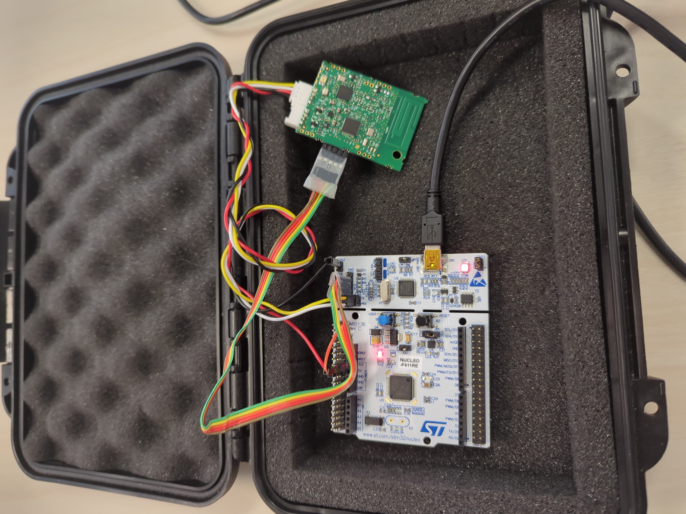

<!-- list_item_newlines: 2 -->

# Premiers pas avec la carte

<!-- column_layout: [1, 1] -->

<!-- column: 0 -->

- Installation des librairies de compilation
- Installation de [RIOT-OS](https://github.com/RIOT-OS/RIOT)
- Débugging 😭
- Installation de [RIOT-wyres](https://github.com/CampusIoT/RIOT-wyres)

<!-- column: 1 -->



<!-- end_slide -->

# Customisation du driver

## Commandes TX/RX hexadécimal

```c {1-30|1|3-9,15-17|20-28} +line_numbers
static uint8_t txhex_payload[255];

static void print_hex_payload(const uint8_t *buf, size_t len)
{
    for (size_t i = 0; i < len; i++)
    {
        printf("%02X", buf[i]);
    }
}

int send_hex_cmd(int argc, char **argv)
{
    // ...

    size_t len = convert_hex(txhex_payload, sizeof(txhex_payload), argv[1]);
    
    print_hex_payload(txhex_payload, len);
    printf(") (%u bytes)\n", (unsigned)len);

    iolist_t iolist = {
        .iol_base = txhex_payload,
        .iol_len = len};
    netdev_t *netdev = &sx127x.netdev;

    if (netdev->driver->send(netdev, &iolist) == -ENOTSUP)
    {
        puts("Cannot send: radio is still transmitting");
    }
    return 0;
}
```

<!-- end_slide -->

# LoRa ₍ᐢ֎ﻌ֍ᐢ₎ʃ

## Format de messages

`ID-Source@ID-dest:message`

Avec un broadcast sur `*` :

`ID-source@*:message`

<!-- new_lines: 3 -->

## Commandes

- `init` : initialise le modem SX127x
- `setup <bw> <sf> <cr>` : regle la modulation LoRa
- `channel set <hz>` : regle la frequence
- `listen` : passe en ecoute continue
- `id get|set <n>` : lit ou fixe l'identifiant local
- `chat_send <dest_id|*> <message>` : envoie une trame `src@dest:message` ou
  `src@*:message`

<!-- new_lines: 3 -->

## Limitations et Risques de sécurité

- 💢 Saisie "cassée" à la réception d'un message
- 👀 Messages privés reçus en clair par chaque noeud
- 🥸 Usurpation d'identité
- 😈 Payload malicieux
